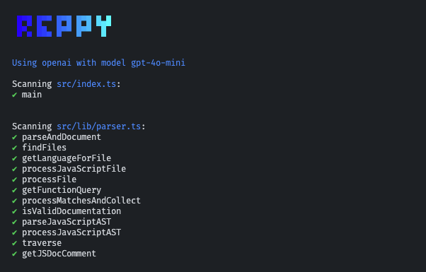

# 🪄 reppy - let AI document your code

Use your favourite LLM to document for your entire codebase with just one command!

[](https://www.npmjs.com/package/reppy)



## ⭐️ Quick Start

1. Install with 1 command:

```bash
npm install -g reppy
```

2. **Add your chosen LLM API key to your project's `.env` file (check `.env.example` for options):**

```
OPENAI_API_KEY=sk-1293527sd1824h
```

or, set it via your console:

```bash
export OPENAI_API_KEY=sk-1293527sd1824h
```

3. **Run the documentation generator:**

```zsh
reppy
```

Run `reppy -h` to see a list of available commands.

> N.B. You can also run `reppy` with `npx reppy`

## Features

- Git-awareness (ensures existing changes are committed before running)
- Auto-commit after documentation
- Saves your wallet by skipping functions that are already documented
- Concurrently process documentation tasks
- Create a `REPPY-README.md` file to document all the functions in your codebase

### Coming soon

- [ ] Implement logic to allow for optional re-documentation of existing functions

## Support

### Langauges

- [x] Typescript & Javascript
- [x] Rust
- [x] Golang
- [x] Java
- [x] Python

### Models

- [x] OpenAI
- [x] Azure OpenAI
- [x] Amazon Bedrock
- [x] Anthropic
- [x] Cohere
- [x] Groq

## License

This project is licensed under the MIT License - see the LICENSE file for details.
